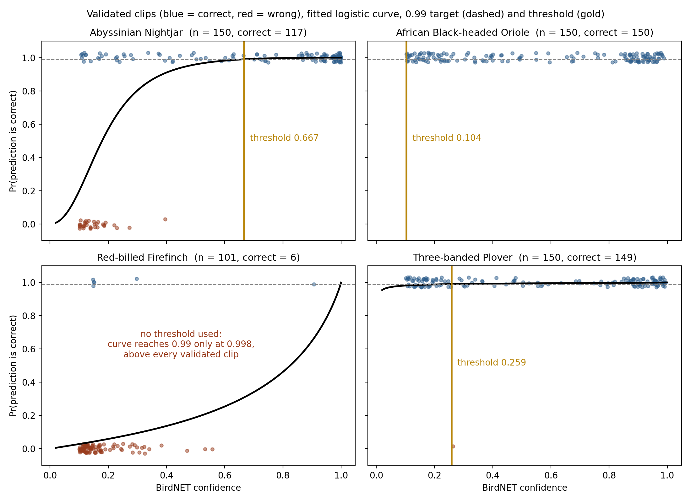
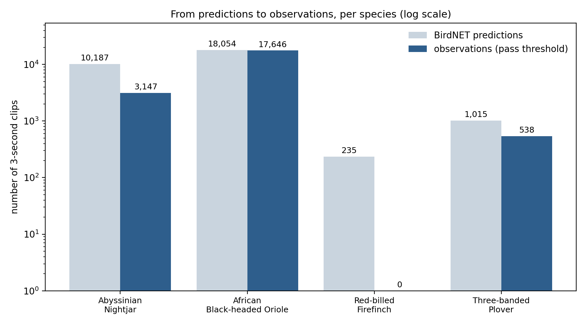

# Bird challenge: from BirdNET predictions to observations

**Question asked.** BirdNET scores every 3-second clip with a confidence between 0 and 1 for a species. An ornithologist checked a sample of clips. Using a 99 percent probability-of-correctness cutoff, assign every clip in `birdnet_predictions.csv` a label in a new `observation` field.

**Short answer.** Two species get a threshold from the fitted curve (Abyssinian Nightjar 0.667, Three-banded Plover 0.259), one species cannot have a curve because every checked clip was correct and gets an evidence-based threshold instead (African Black-headed Oriole 0.104), and one species gets no threshold because the curve only reaches 99 percent above every clip that was ever checked (Red-billed Firefinch). Applying these rules, 21,331 of 29,491 predictions become observations. The labeled file is `outputs/birdnet_predictions_labeled.csv`.

Code: [`01_fit_thresholds.py`](01_fit_thresholds.py) (thresholds) and [`02_label_predictions.py`](02_label_predictions.py) (labels and summaries). Every line is commented for a reader who does not code.

---

## 1. What the data contain

| File | Rows | What a row is |
|---|---|---|
| `birdnet_predictions.csv` | 29,491 | One 3-second clip where BirdNET proposed one of four species, with its confidence. 40 recorders (RBS02 to RBS73, all in Grid2), 20 June to 12 July 2023, confidence 0.10 to 1.00. |
| `validation_results.csv` | 551 | One clip an ornithologist listened to, with `outcome` = 1 (BirdNET correct) or 0 (wrong). BirdNET v2.4 throughout. |

Validated clips per species, and how often BirdNET was right in each confidence band:

| Confidence band | Abyssinian Nightjar | African Black-headed Oriole | Red-billed Firefinch | Three-banded Plover |
|---|---|---|---|---|
| 0.1 to 0.2 | 14 / 43 | 33 / 33 | 4 / 77 | 39 / 39 |
| 0.2 to 0.3 | 8 / 11 | 16 / 16 | 1 / 14 | 13 / 14 |
| 0.3 to 0.4 | 4 / 5 | 13 / 13 | 0 / 6 | 8 / 8 |
| 0.4 to 0.9 | 37 / 37 | 49 / 49 | 0 / 3 | 47 / 47 |
| 0.9 to 1.0 | 54 / 54 | 39 / 39 | 1 / 1 | 42 / 42 |
| **Total** | **117 / 150** | **150 / 150** | **6 / 101** | **149 / 150** |

Three things I noticed before fitting anything:

1. The validated clips are spread evenly across the confidence range while the predictions pile up at low confidence (median confidence 0.28 to 0.32). The sample was stratified on purpose, which is what Wood and Kahl (2024) recommend. It means the curves describe "how often BirdNET is right at a given confidence", not "how often it is right overall".
2. Only 263 of the 551 validated clips can be matched back to a row in the predictions file (same recorder, file, confidence and species). The ornithologist drew from a larger pool of predictions than the file we were given. This does not affect the method; the thresholds learned from the sample are applied to the file.
3. Some predictions carry a confidence of exactly 1.0. The logit transform, ln(c / (1 - c)), is infinite at 1.0. I clip confidences to the range 0.0001 to 0.9999 before transforming, so these clips stay labelable. Scanferla et al. (2025) dropped such clips instead; clipping keeps every prediction in the output.

## 2. Method

The method follows Wood and Kahl (2024). For each species:

1. Convert each validated clip's confidence to the logit scale. The logit spreads out the scores that pile up near 1, which makes the curve fit better; it does not change the logic.
2. Fit a logistic regression of `outcome` (1 or 0) on the logit confidence. This draws the smoothest S-shaped curve through the yes/no marks; its height at any confidence is the estimated probability that a prediction at that confidence is correct. This is `glm(outcome ~ logit_score, family = binomial)` in R and `statsmodels.Logit` in Python; the two give identical numbers.
3. Solve the curve for the confidence at which the probability is 0.99: threshold = inverse-logit((logit(0.99) - intercept) / slope).
4. Put an uncertainty range on the threshold by refitting on 1,000 bootstrap resamples of the validated clips.
5. Count how many validated clips sit at or above the threshold and how many of those were correct, and compute the exact binomial 95 percent lower bound on that precision. This is the plain-counting evidence behind each threshold, independent of any curve.
6. Label: a prediction is an observation if its confidence is at or above its species' threshold.

Two situations the standard method cannot handle, and the rule I applied to each:

- **Every validated clip is correct (complete separation).** The S-curve needs some wrong clips on the left to know where the step is. With none, every curve above 0.99 fits equally well, the slope runs off to infinity, and the software reports non-convergence (Albert and Anderson 1984). Rather than force a curve, I use the model-free rule from Tseng et al. (2025): the threshold is the lowest confidence that was validated, since every validated clip at or above it was correct. I then state honestly how much precision that evidence certifies (see Section 3). Firth-penalized regression or a Bayesian prior on the slope (Heinze and Schemper 2002; Gelman et al. 2008) would return finite coefficients by penalising very steep curves, and either can be attempted if a curve-based threshold is required for such species. The caveat is that the resulting slope is set by the penalty rather than by the data, so the threshold it yields is an assumption rather than evidence of 99 percent precision; neither method is used in the BirdNET literature.
- **The curve reaches 0.99 only above every validated clip.** A threshold with zero validated clips at or above it is an extrapolation of the curve, not evidence. I do not use such a threshold to create observations. Scanferla et al. (2025) found the 0.99 target unreachable for 16 of 72 species for the same reason.

## 3. Results: one threshold per species

| Species | Validated (correct) | How the threshold was set | Threshold | Bootstrap 95% range | Validated clips at or above (correct) | Precision certified at 95% confidence |
|---|---|---|---|---|---|---|
| Abyssinian Nightjar | 150 (117) | logistic curve (intercept 3.16, slope 2.07) | **0.667** | 0.457 to 0.825 | 74 (74) | at least 0.960 |
| African Black-headed Oriole | 150 (150) | all clips correct; lowest validated confidence | **0.104** | not applicable | 150 (150) | at least 0.980 |
| Three-banded Plover | 150 (149) | logistic curve (intercept 5.17, slope 0.55) | **0.259** | 0.216 to 0.802 | 100 (99) | at least 0.953 |
| Red-billed Firefinch | 101 (6) | curve reaches 0.99 only at 0.998, above every validated clip | **none** | 0.937 to 1.000 | 0 (0) | not estimable |

How to read each row:

- **Nightjar** is the textbook case. Errors sit below 0.35 and the curve climbs through 0.99 at 0.667. The bootstrap range is wide (0.46 to 0.83) because only 11 clips were validated between 0.3 and 0.6, exactly where the curve bends; validating 50 more clips in that band would narrow it.
- **Oriole** is the species BirdNET gets right at every score we have evidence for, down to 0.10. A curve cannot be fitted; the evidence says "no errors in 150 clips". With zero errors in n clips the 95 percent upper bound on the error rate is about 3/n (the rule of three, Hanley and Lippman-Hand 1983), so 150 clips certify precision of at least 0.98, not 0.99. Certifying 0.99 would need about 300 validated clips with no errors. I apply 0.104 as the threshold because that is what the data support, and I label the table accordingly rather than claiming 0.99.
- **Plover** has a single wrong clip, at confidence 0.26, and that one clip decides the curve. The fitted threshold (0.259) sits right on it, which is why the bootstrap range is so wide (0.22 to 0.80) and why 1 of the 100 validated clips above the threshold is wrong. Re-checking that one clip is the single most effective way to stabilise this threshold.
- **Firefinch** is the opposite case. Only 6 of 101 validated clips were correct and only one of those had a high score. The curve technically reaches 0.99 at confidence 0.998, but no validated clip sits that high, so there is no evidence at that score. No Firefinch prediction is labeled as an observation. If Firefinch matters to the project, the fix is to validate its high-confidence clips specifically (there are only 8 predictions above 0.5 in this dataset) or to accept a lower precision target for this species.

**The main limitation, which applies to every species:** with 150 validated clips, none of the four thresholds can be certified at 99 percent precision with 95 percent confidence. The best is the Oriole at 0.98. The 0.99 target is at the edge of what 150 clips can prove; Scanferla et al. (2025) reached the same conclusion and recommend 0.90 or 0.95 as targets that the usual sample sizes can support. I kept 0.99 because that is what the specification asks for, and I report the certified precision next to it so nobody mistakes one for the other.

## 4. Results: the labeled predictions

| Species | Predictions | Observations | Share kept | Recorders with at least one observation |
|---|---|---|---|---|
| African Black-headed Oriole | 18,054 | 17,646 | 97.7% | 35 of 40 |
| Abyssinian Nightjar | 10,187 | 3,147 | 30.9% | 16 of 40 |
| Three-banded Plover | 1,015 | 538 | 53.0% | 12 of 40 |
| Red-billed Firefinch | 235 | 0 | 0% | 0 of 40 |
| **All** | **29,491** | **21,331** | **72.3%** | **39 of 40** |

The output file keeps every original column, in the original row order, with the same 29,491 rows (the script checks this), and adds two columns:

- `observation`: the species common name when the clip passes its species threshold, otherwise empty.
- `label_reason`: `at_or_above_threshold` (21,331 clips), `below_threshold` (7,925) or `no_threshold_for_species` (235, all Firefinch). A fourth value, `invalid_input`, is reserved for rows with a missing species or a confidence outside 0 to 1; none occur in this file. An empty `observation` is therefore never ambiguous, and it never means the species was absent: it means the prediction was not accepted.

"Share kept" is not recall. The validation set contains only clips that BirdNET flagged, so it says nothing about calls BirdNET missed; precision and recall have different denominators (Knight et al. 2017). The Nightjar keeps 31 percent of its predictions, which is a statement about how many predictions survive the cutoff, not about how many Nightjar calls were detected.

Per-recorder counts are in `outputs/summary_by_recorder.csv`. Three 3-second segments carry predictions for two different species at once; both rows are labeled independently, which is correct because two birds can call in the same 3 seconds.

## 5. Decisions made along the way

| Decision | Choice | Why |
|---|---|---|
| x-axis of the regression | logit of confidence | Wood and Kahl recommend it; the raw 0 to 1 scale compresses the high scores. The threshold is converted back to confidence for use. |
| Confidence of exactly 1.0 | clipped to 0.9999 | logit(1) is infinite; dropping the clips would leave predictions unlabeled. |
| BirdNET sensitivity setting | assumed default (1.0) | BirdNET's sensitivity setting (0.5 to 1.5) controls how sharply the raw score is squashed into the 0 to 1 confidence, and Wood and Kahl's logit formula divides by it. The setting used was not supplied. Dividing every x by a constant only rescales the slope; the threshold is unchanged once converted back to the confidence scale, so the assumption does not affect the results. |
| Species with all validations correct | lowest validated confidence, with certified precision stated | A curve does not exist; forcing one with penalties is not standard in this field. The empirical rule is used by Tseng et al. (2025). The stricter alternative, assigning no Oriole observations until 0.99 is certified, was considered and rejected: it would discard 150 of 150 correct validations, and by the same standard no species in this dataset qualifies, since even the Nightjar's 74 clips above its threshold certify only 0.96. The sample size, not the method, is what limits certification, and the report says so. |
| Threshold above every validated clip | not used | An extrapolated threshold has no evidence behind it. |
| Precision target | 0.99 as specified | Reported alongside the certified lower bound so the two are not confused. |
| Uncertainty | 1,000 bootstrap resamples | The threshold is a ratio of two fitted coefficients, so the model's standard errors do not describe its uncertainty well at 150 clips. Resampling the validated clips gives a range without that assumption and shows which thresholds rest on few clips. |

## 6. What I would do next with the same data

- Validate about 50 more Nightjar clips between 0.3 and 0.6, and have the single wrong Plover clip re-checked. Both would tighten the thresholds more than any change of method.
- Validate Firefinch clips above 0.5 specifically, since the current sample has almost none.
- Decide with the biometrics team whether 0.99 is the right target given sample sizes, or whether 0.95 with a documented bound is more useful for the Pillar Metrics.
- At platform scale, with hundreds of species, fit one mixed model with species as a grouping factor (Thompson et al. 2025) so species with few validations borrow strength from the others. This is described in the handover document.

## References

- Wood CM, Kahl S (2024). Guidelines for appropriate use of BirdNET scores and other detector outputs. Journal of Ornithology 165: 777-782.
- Tseng S, Hodder DP, Otter KA (2025). Setting BirdNET confidence thresholds: species-specific vs. universal approaches. Journal of Ornithology. doi:10.1007/s10336-025-02260-w.
- Scanferla J, Brambilla M, et al. (2025). Determining species-specific thresholds to improve precision in passive acoustic monitoring. Ecological Informatics 91: 103423.
- Thompson MC, Ducey MJ, Gunn JS, Rowe RJ (2025). A post-processing framework for assessing BirdNET identification accuracy and community composition. Ibis 167: 530-542.
- Albert A, Anderson JA (1984). On the existence of maximum likelihood estimates in logistic regression models. Biometrika 71: 1-10.
- Heinze G, Schemper M (2002). A solution to the problem of separation in logistic regression. Statistics in Medicine 21: 2409-2419.
- Gelman A, Jakulin A, Pittau MG, Su Y-S (2008). A weakly informative default prior distribution for logistic and other regression models. Annals of Applied Statistics 2: 1360-1383.
- Hanley JA, Lippman-Hand A (1983). If nothing goes wrong, is everything all right? Interpreting zero numerators. JAMA 249: 1743-1745.
- Knight EC, Hannah KC, Foley GJ, Scott CD, Brigham RM, Bayne E (2017). Recommendations for acoustic recognizer performance assessment with application to five common automated signal recognition programs. Avian Conservation and Ecology 12(2): 14.
