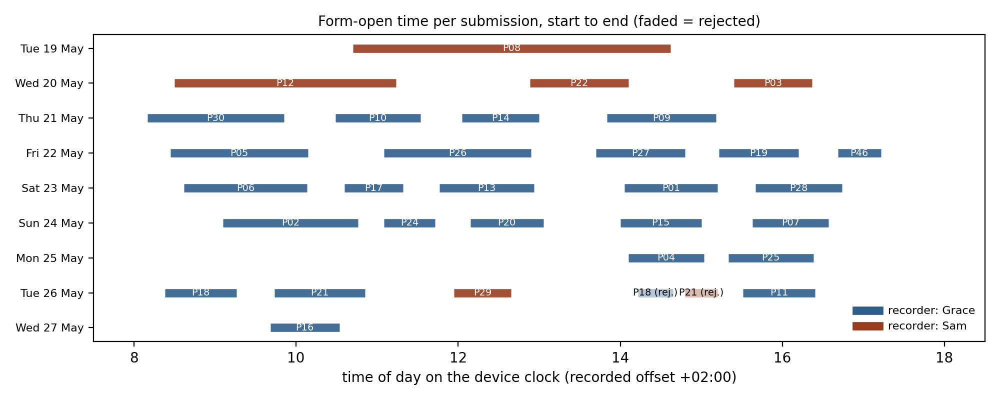
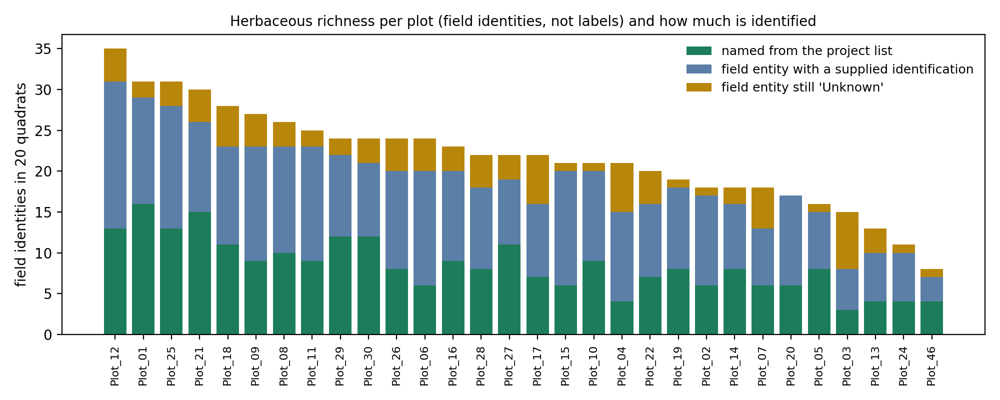
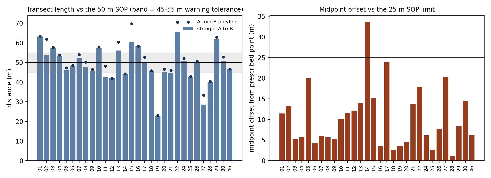
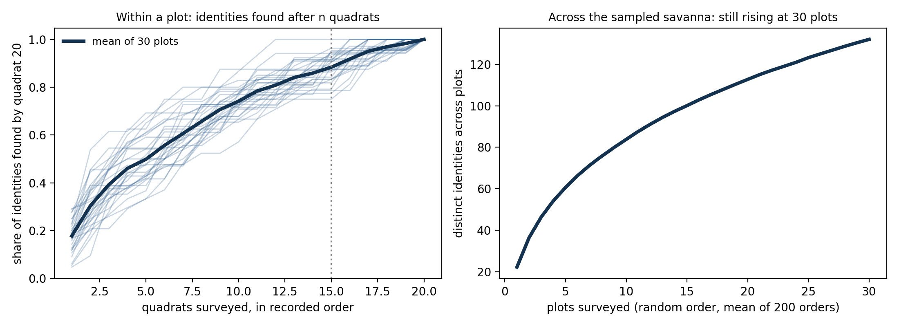
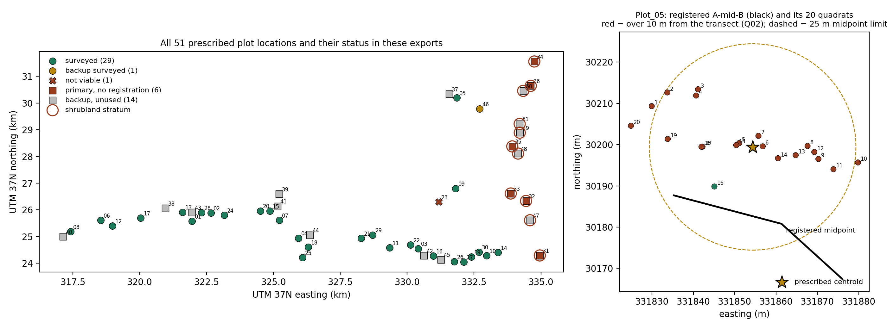

# Herbaceous vegetation survey: data quality report

**Project:** Savanna Monitoring Pilot (SAVMON), area LW, baseline replicate `lw_baseline`, survey `savmon|lw|herbs|ho`.
**Data:** ODK exports of the Herbaceous Vegetation Survey form ({{m:n_submissions}} submissions, 640 quadrats, 1,296 additional-species rows), the Register Vegetation Plots form (31 registrations), and the entity lists, including the identification list `species_extra_ids`. SOPs: Vegetation Plot Registration v2026.1 and Herbaceous Vegetation Surveys v2026.1.
**Rule followed:** nothing in the data was changed. Every problem is flagged with a rule id, a severity, its population and the exact record, in `outputs/qa_issues.csv`. Summaries use the retained population: the {{m:n_retained}} submissions that ODK Central has not rejected. An identity recorded twice in one quadrat counts once. Frequency across quadrats is the abundance index, as the SOP states.

Code: [`01_load_and_join.py`](01_load_and_join.py) (join the exports and entity lists into five tidy tables), [`02_qa_checks.py`](02_qa_checks.py) ({{m:n_rules}} rules), [`03_report_tables_and_maps.py`](03_report_tables_and_maps.py) (tables, figures, maps, metrics), [`04_assemble_report.py`](04_assemble_report.py) (fills every number and table in this report from the outputs).

---

## Headline findings

1. **Species must be counted on entities, not labels.** {{m:label_count}} distinct labels were recorded, but they belong to {{m:identity_count}} field identities: 28 from the project list, {{m:identities_typed}} typed names and {{m:identities_placeholder}} placeholders created in the field. {{m:alias_entities}} entities appear under two labels, their typed name and their `herb_###` placeholder. Of the {{m:identity_count}} identities, {{m:identities_named}} have a name from the list or from `species_extra_ids`, and {{m:identities_unknown}} are still "Unknown". Every richness and diversity number below is computed on identities.
2. **The sampling design is incomplete in these exports.** All 30 primary savanna plots were visited: 29 surveyed, Plot 23 recorded not viable, backup Plot 46 surveyed. None of the {{m:shrub_primary}} primary shrubland plots has a registration or a survey here.
3. **Two plots were submitted twice** (Plot 18 and Plot 21). The second copies are marked rejected in ODK Central and are excluded from summaries. The rule still lists them so nobody counts {{m:n_submissions}} surveys.
4. **Transect geometry often departs from the SOP numbers.** Straight A-to-B distances run from {{m:length_min}} to {{m:length_max}} m against a 50 m specification. One midpoint ({{m:offset_max_plot}}) is {{m:offset_max}} m from its prescribed point against a 25 m limit. Every transect bears between {{m:bearing_min}} and {{m:bearing_max}} degrees, where the SOP says north-south unless rotated, and no rotation reason is recorded. In {{m:zoom_plot}}, {{m:zoom_n_flagged}} of 20 quadrats lie {{m:zoom_d_min}} to {{m:zoom_d_max}} m from the registered transect, so the registration and the quadrat geopoints disagree.
5. **Typed names need a review queue.** {{m:x01}} names were typed in the field, all with a space where the SOP asks for `Genus_species`. {{m:x03_fuzzy}} differ from the GBIF spelling and {{m:x03_higher}} match only at genus or family. One already exists on the project list. The identification list adds a note to {{m:notes_n}} identities, saying they duplicate another or should be excluded as woody; those are queued, not applied.
6. **The form's own end-of-survey count is the wrong quantity.** The "quadrats with species" number shown to the team differs from the rows in {{m:s04_retained}} of {{m:n_retained}} retained submissions. The form's calculation tests the list-species field at the wrong nesting level, so it only counts quadrats with additional species. It equals that count in all {{m:n_submissions}} submissions.
7. **20 quadrats do not exhaust a plot.** On average {{m:share15_mean}} percent of a plot's identities are found by quadrat 15, and {{m:late_plots}} of {{m:n_plots_acc}} plots added at least one identity in quadrats 16 to 20. Across plots the count is still rising at 30 plots.

Issue totals: {{m:issues_retained}} flagged rows in the retained population ({{m:errors_retained}} errors, {{m:warnings_retained}} warnings, {{m:info_retained}} informational). {{m:n_rules_pass}} of {{m:n_rules}} rules found nothing. Full catalogue in Section 5.

---

## a. Survey-level summary

{{a_overall}}

One row per retained survey, that is one plot visit. Times are the device clock as recorded. The devices applied an offset of {{m:device_offset}} while the project zone is +03:00, so wall-clock readings are one hour behind Nairobi time. `quadrats_with_species_form` is the number the ODK form displayed at the end; `quadrats_with_records` is the recount from the rows (Section 5, S04). `issues_direct` counts errors and warnings on the submission itself; `issues_quadrats` counts those on its quadrats and species rows.

{{a_survey_summary}}

What the timeline shows. One team of three worked {{m:date_first}} to {{m:date_last}}; {{m:recorders}}. Retained form-open time totals {{m:survey_minutes}} minutes, or {{m:person_hours}} nominal person-hours, about {{m:person_hours_per_plot}} per plot. Form-open time includes interruptions and does not measure active work. The first survey, Plot 08 on 19 May, is the longest at about four hours. It also started with zero active placeholders, which is expected for the first survey of a campaign (rule S06). The two rejected submissions of 26 May lasted 25 to 26 minutes and record plots already surveyed that morning; the export does not say why they were rejected.

## b. Plot-level summary

Richness is the number of distinct field identities recorded in the plot's 20 quadrats. `label_count` is the number of distinct labels, for comparison. `identities_named` counts identities with a list name or a supplied identification. Shannon diversity is the natural-log entropy of the number of quadrats each identity occupied; it is not cover or abundance, which were not measured. `geometry_flags` counts the transect warnings and errors (P02 to P04) and `quadrats_off_transect` the Q02 flags for the plot.

{{b_plot_summary}}

Reading the plot table:

- Richness ranges from {{m:richness_min}} identities ({{m:richness_min_plot}}) to {{m:richness_max}} ({{m:richness_max_plot}}). Label counts are higher wherever an entity was recorded under both its typed name and its placeholder.
- Registration context, from the viable registered plots:

{{b_registration_context}}

- Disturbance was recorded in {{m:dist_any}} of {{m:n_viable}} viable plots: wildlife in {{m:dist_wildlife}}, human or livestock in {{m:dist_human}}, both in {{m:dist_both}}. Every plot has woody plants and no nearby water. One plot was recorded as Forest inside the savanna stratum.
- Transect geometry: straight A-B distances {{m:length_min}} to {{m:length_max}} m against the 50 m SOP; the 45 to 55 and 40 to 60 m bands are analysis tolerances. Midpoint offsets reach {{m:offset_max}} m against the 25 m limit; {{m:offset_over25}} exceed it and {{m:offset_15_25}} sit between 15 and 25 m. Bearings run {{m:bearing_min}} to {{m:bearing_max}} degrees. {{m:midpoint_off_line_n}} midpoints lie more than 5 m off the straight A-B line. All geometry is computed from recorded coordinates with reported accuracy of 5 m or better; it measures the coordinates, not the tape.

## c. Assessment of sampling effort

### Design coverage

{{c_design_coverage}}

The design prescribed {{m:n_primary_design}} primary plots in two strata plus backups. The savanna stratum is complete in these exports: {{m:n_primary_surveyed_design}} primaries surveyed, Plot 23 recorded not viable because it falls on private property, backup Plot 46 surveyed. The shrubland stratum (Plots 31 to 36, backups 47 to 51) has no registration and no survey in the supplied files. Any area-level statement from this baseline describes the sampled savanna plots only. {{m:year_missing}} of the 51 prescribed points have no survey year in the design list.

### Effort

{{m:n_retained}} retained surveys, {{m:n_quadrats}} quadrats, {{m:survey_minutes}} form-open minutes, about {{m:person_hours}} person-hours with three people throughout, roughly {{m:person_hours_per_plot}} per plot. Quadrats were never skipped: every submission holds exactly 20, {{m:n_quadrats_herbs}} of {{m:n_quadrats}} contained herbaceous species, and every quadrat has a photo and a geopoint with reported accuracy of 5 m or better. The 20 one-square-metre quadrats sample 20 m² of each 250 m² belt transect.

### Does 20 quadrats per plot capture the plot?

Left panel: for each plot, the share of the identities found by quadrat 20 that had already been found after 1, 2, ... 15 quadrats, in the recorded order. The mean reaches {{m:share15_mean}} percent at quadrat 15 (median {{m:share15_median}}, lowest {{m:share15_min}}). {{m:late_plots}} of {{m:n_plots_acc}} plots recorded at least one new identity in quadrats 16 to 20 (table below). The curve shows that identities were still accumulating at the end of the transect; it does not say how many taxa the whole transect holds. Right panel: distinct identities across plots, averaged over 200 random plot orders with the plot as the sampling unit (Colwell et al. 2012). It rises from {{m:across25}} after 25 plots to {{m:across30}} after 30 with no sign of flattening. The 200 orders give an average, not a confidence interval. The fixed design records most, but not all, of what is present. That is acceptable for a change-detection baseline if the next replicate repeats the same effort, placement and identification practice.

{{c_saturation_by_plot}}

### Where effort would help most

- Register and survey the six shrubland primaries, or record that the stratum is dropped and why.
- Resolve the {{m:identities_unknown}} identities still "Unknown" from the vouchers and photos. Act on the {{m:notes_n}} notes in the identification list and merge the {{m:alias_entities}} alias pairs in the identification layer.
- Re-establish the transects whose recorded geometry fails the SOP numbers before the next replicate, comparing the registration points with the quadrat geopoints and the photos on site.

## d. Map of transect locations

Left: all 51 prescribed locations in UTM 37N, by their status in these exports. The rings mark the shrubland stratum, which has no data. Primary points without a registration are shown apart from unused backups. Right: {{m:zoom_plot}} at full resolution, the plot with the most quadrats flagged by rule Q02 ({{m:zoom_n_flagged}} of 20, at {{m:zoom_d_min}} to {{m:zoom_d_max}} m from the registered transect, drawn in black). The quadrats form an east-west band around the prescribed centroid (star) while the registered transect runs further south. The dashed circle is the 25 m limit for relocating the midpoint, drawn for scale. Both coordinate sets were recorded with 5 m accuracy or better and disagree by more than that; which one reflects where the tape lay needs the photos or a site visit. The same pattern, less extreme, accounts for most of the {{m:q02_retained}} retained quadrats flagged by Q02.

---

## 5. Issue catalogue

Every rule is a few lines in `02_qa_checks.py`, named after what it tests. The SOP numbers sit in one `SOP` dictionary and the analysis tolerances in a separate `CONFIG` dictionary. Each issue row carries its population (retained, rejected or shared) and the exact record. Rules that found nothing are listed with status pass.

{{qa_summary}}

Notes on the rules that need interpretation:

- **S04, form count differs from recount.** The form's calculation tests the list-species field at the wrong nesting level, so it only counts quadrats with additional species. It equals that count in all {{m:n_submissions}} submissions. Nothing is wrong with the rows; the form should be corrected in its next version.
- **S06, placeholders.** Zero active placeholders at the start of the first survey is expected. A later survey showing zero would need the device's sync history before concluding anything.
- **P04, midpoint off the A-B line.** {{m:midpoint_off_line_n}} recorded midpoints are more than 5 m off the straight line between A and B, up to {{m:midpoint_off_line_max}} m. Q02 therefore measures quadrats against the A-mid-B transect, which is also what the maps draw.
- **P05, not north-south ({{m:n_viable}} of {{m:n_viable}}).** The SOP allows rotation to avoid obstacles but asks for north-south first and gives no field for the reason. The flag means "reason not recorded".
- **Q02, quadrat off the registered transect.** With reported accuracy of up to 5 m on the quadrat and on each registration point, about 10 m of apparent offset is within noise. Offsets of 20 m or more are not. Severity splits at 25 m. The retained count is {{m:q02_retained}} of {{m:n_quadrats}} quadrats, {{m:q02_retained_err}} of them beyond 25 m.
- **X01, spaces instead of underscores ({{m:x01}} names).** The form constraint only blocks commas, semicolons and brackets, and its hint shows a space. The SOP's `Genus_species` format is never enforced. A space does not make the identification wrong.
- **X03, GBIF match.** Each typed name was matched against the GBIF backbone, the source of `species.csv`. {{m:x03_fuzzy}} names matched with a spelling difference and {{m:x03_higher}} only at a higher rank. A match is a suggestion for review, not an identification. `outputs/gbif_name_check.csv` is the review queue.
- **X04, one entity under two labels.** {{m:alias_entities}} entities were recorded under their typed name and under their `herb_###` placeholder. They count as one identity everywhere in this report. The identification list also carries {{m:notes_n}} notes (duplicate of another placeholder, or woody and to be excluded). All are queued for the identification layer; none is applied to the data.

## References

- Colwell RK, Chao A, Gotelli NJ, Lin S-Y, Mao CX, Chazdon RL, Longino JT (2012). Models and estimators linking individual-based and sample-based rarefaction, extrapolation and comparison of assemblages. Journal of Plant Ecology 5: 3-21.
- Lehmann CER, Archibald S, Vorontsova MS, Hempson GP, Wieczorkowski JD (2022). "Manisa bozaka" or "Counting grass": Global Grassy Group guide to understanding and measuring the functional and taxonomic composition of ground layer plants. Protocol Exchange.
